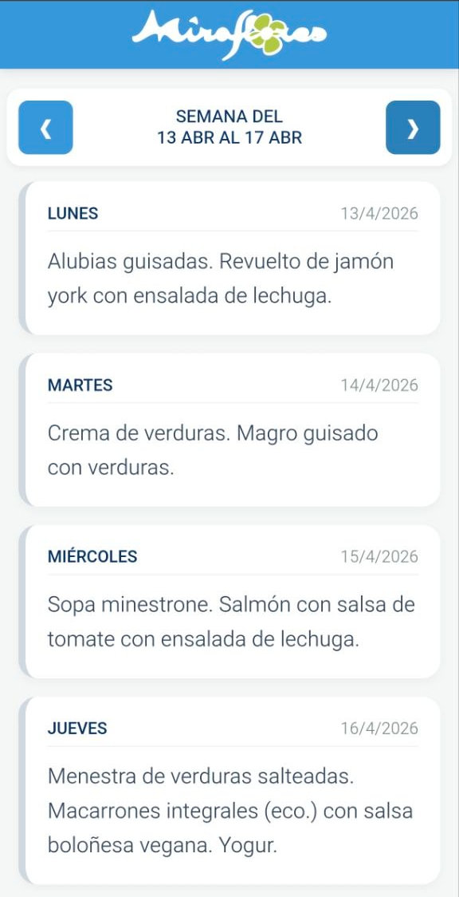

# 🍽️ Menú Escolar - CEIP Miraflores

Una aplicación web ligera, rápida y **mobile-first** diseñada para que las familias del CEIP Miraflores puedan consultar el menú del comedor escolar de forma sencilla desde sus dispositivos móviles.


<p align="center">
  
</p>

## ✨ Características Principales

-   📱 **Optimización Móvil:** Diseño responsivo pensado para una consulta rápida en el día a día.
-   🗓️ **Lógica Inteligente de Fechas:** -   Detecta automáticamente la semana actual.
    -   **Salto de Fin de Semana:** Si se abre la app un sábado o domingo, muestra automáticamente la semana siguiente.
-   📍 **Indicador de "HOY":** Resaltado visual con borde verde y etiqueta distintiva para identificar el menú del día actual al instante.
-   🔄 **Navegación Intuitiva:** Botones de navegación semanal y función de "Reset" (vuelve a la semana actual al tocar el logo del centro).
-   🚀 **Arquitectura Limpia:** Separación total de responsabilidades en archivos HTML, CSS y JS independientes.

## 🛠️ Estructura del Proyecto

```text
.
├── assets/             # Recursos estáticos (imágenes, mockups)
│   └── mobile-preview.jpg
├── index.html          # Punto de entrada y estructura DOM
├── style.css           # Hoja de estilos y variables de diseño
├── script.js           # Lógica de fechas, fetch de datos y renderizado
├── menu_mira.json      # Base de datos local de menús (JSON)
├── ai.sh               # Script de utilidad para sincronización con IA
├── .gitignore          # Archivos excluidos del control de versiones
└── README.md           # Documentación del proyecto
```

## 🚀 Instalación y Uso Local
Debido a que la aplicación utiliza la API fetch() para cargar el archivo JSON de forma relativa, los navegadores bloquean la carga si se abre el archivo HTML directamente (por seguridad CORS).

Para ejecutarlo en local:

1. Clona este repositorio.
2. Usa un servidor local. En linux `python3 -m http.server`
3. Abre index.html a través del servidor local (ej: http://localhost:8000).

## 📊 Formato de Datos (JSON)
Para actualizar los menús, simplemente edita el archivo menu_mira.json siguiendo este formato:

``` JSON
{
  "fecha": "2026-04-07",
  "menu": "Crema de verduras (eco). Filete de abadejo al horno con guarnición."
}
```
La app soporta varios formatos de fecha (YYYY-MM-DD, DD/MM/YYYY) para mayor flexibilidad.

## 🌐 Despliegue
Este proyecto está optimizado para ser desplegado en GitHub Pages:

- Sube los archivos a tu repositorio de GitHub.
- Ve a Settings > Pages.
- En "Build and deployment", selecciona la rama main y guarda.
- ¡Listo! Tu app estará online en segundos.

## 🤖 Herramientas de Desarrollo (ai.sh)
Para facilitar el mantenimiento y la evolución del proyecto mediante Inteligencia Artificial, se ha incluido una pequeña utilidad de automatización:
- `ai.sh`: Es un script de shell diseñado para empaquetar automáticamente todo el código fuente y la estructura del proyecto en un único archivo de texto llamado `ai_context.txt`.
- Uso: Al ejecutarlo, genera una "foto" actualizada del estado del código, permitiendo que un asistente de IA comprenda el contexto completo de la aplicación sin necesidad de revisar archivo por archivo.
- Privacidad: El archivo generado (ai_context.txt) está incluido en el .gitignore para evitar subir redundancias de código al repositorio de GitHub.

- ⚖️ Licencia
Este proyecto es de código abierto y está bajo la licencia MIT.

Desarrollado con ❤️ para la comunidad educativa del CEIP Miraflores.

